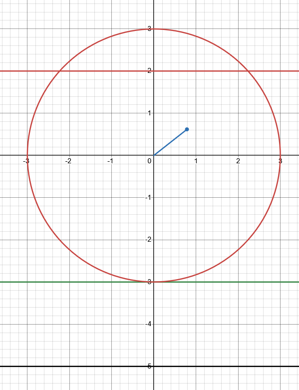

# Esercizi del 18/02/26

## Formule

### Equazione della circonferenza

$x^2 + y^2 + ax + by + c = 0$

### Centro della circonferenza

$C = (-\dfrac{a}{2}, -\dfrac{b}{2})$

### Raggio della circonferenza

$r = \sqrt{\dfrac{a^2}{4} + \dfrac{b^2}{4} - c}$

### Raggio della circonferenza conoscendo il centro e un punto della circonferenza

$r = \sqrt{(x_p - x_C)^2 + (y_p - y_c)^2}$

### Equazione di una circonferenza con centro $C(x_C, y_C)$ e raggio $r$ (l'equazione denota la relazione dei punti con la criconferenza del dato centro e raggio):

$(x - x_C)^2 + (y - y_C)^2 = r^2$

### Per individurare tutti e soli i punti interni alla circonferenza usiamo questa disequazione:

$(x - x_C)^2 + (y - y_C)^2 < r^2$

### Equazione della retta tangente ad una circonferenza in un punto

Dato il punto $P = (x_p, y_p)$ e la circonferenza d'equazione $x^2 + y^2 + ax + by + y = 0$:

$x_{p_x} + y_{p_y} + a \cdot \dfrac{x + x_p}{2} + b \cdot \dfrac
{y + y_p}{2} + c = 0$

---

## Esercizi

### Esercizio 1

$x^2 + y^2 - 4x + 2y - 4 = 0$

$C = (-\dfrac{a}{2}, -\dfrac{b}{2})$

$C = (-\dfrac{-4}{2}, -\dfrac{2}{2}) = (2, -1)$

$r = \sqrt{\dfrac{a^2}{4} + \dfrac{b^2}{4} - c}$

$r = \sqrt{\dfrac{(-4)^2}{4} + \dfrac{2^2}{4} - (-4)} = \sqrt{4 + 1 + 4} = \sqrt{9} = 3$

### Esercizio 2

Equazione della circonferenza con centro $C = (-1, 3)$ e $r = 4$.

$(x - x_C)^2 + (y - y_C)^2 = r^2$

$(x - (-1))^2 + (y - 3)^2 = 16$

$(x + 1)^2 + (y - 3)^2 = 16$

**SBAGLIATO:** $x^2 + 1 + y^2 + 9 = 16$

**CORRETTO:** $x^2 +2x + 1 + y^2 - 6y + 9 = 16$

$x^2 + y^2 + 2x - 6y - 6 = 0$

---

#### Esempio reale per spiegare i quadrati di binomi che Sara ha sbagliato

$x = 3, y = 2$

$(x + 1)^2 + (y - 3)^2$

Sara ha scritto:

$x^2 + 1 + y^2 + 9$

Sostituendo:

$9 + 1 + 4 + 9 = 23$

Sostituiamo in quella originale:

$(x + 1)^2 + (y - 3)^2$

$(3 + 1)^2 + (2 - 3)^2 = 4^2 + (-1)^2 = 16 + 1 = 17$

Sono due risultati diversi!

Questo perchè non sono stati usati i quadrati di binomi:

$(a + b)^2 = a^2 +2ab + b^2$

---

### Esercizio 3

$C = (1, 2)$

$P$ appartenente alla circonferenza: $P = (1, -1)$

$r = C - P = (0, 2 - (-1)) = (0, 3) \rightarrow r = 3$

$(x - x_C)^2 + (y - y_C)^2 = r^2$

$(x - 1)^2 + (y - 2)^2 = 9$

La `B` non è corretta.

$x^2 -2x + 1 + y^2 -4y + 4 = 9$

$x^2 + y^2 -2x -4y -4 = 0$

Corrispondente all'equazione `D`.

### Esercizio 4

$x^2 + y^2 - 6x - 16 = 0$

a) Passa per $(6, -4)$? Sostituiamo i valori del punto rispettivamente nella $x$ e nella $y$:

$6^2 + (-4)^2 - (6 \cdot 6) - 16 = 0$

$36 + 16 - 36 - 16 = 0 \rightarrow 0 = 0 \rightarrow$ **VERO**

b) Verificare se ha il centro su $y$

$C = (-\dfrac{a}{2}, -\dfrac{b}{2}) = (- \dfrac{-6}{2}, 0) = (3, 0) \rightarrow$ **VERO**

c) Verificare se passa per l'origine

$x^2 + y^2 - 6x - 16 = 0$

Sostituendo e usando il punto $O = (0, 0)$:

$0^2 + 0^2 - 6 \cdot 0 - 16 = 0 \rightarrow 0 = 0 \rightarrow$ **VERO**

d) $r = \sqrt{\dfrac{a^2}{4} + \dfrac{b^2}{4} - c}$

$x^2 + y^2 - 6x - 16 = 0$

$r = \sqrt{\dfrac{36}{4} + \dfrac{0}{4} + 16} = \sqrt{9 + 0 + 16} = \sqrt{25} = 5 \rightarrow$ **VERO**

### Esercizio 5

$C = (0, y_C)$

$r = 3$

